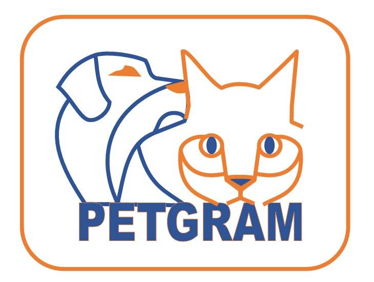

# Rede Social - Petgram 1.0

O projeto __Petgram__ tem como objetivo ser uma rede social específica para donos de pets.

Todo material está publicado sob licença [GPL-3.0](https://www.gnu.org/licenses/quick-guide-gplv3.pt-br.html).

### Artefatos do Projeto
* [Documento de visão `/docs/visao_do_produto.md`](./docs/visao_do_produto.md)

* Documento de Requisitos

* Detalhamento de casos de uso 

    1. [Cancelar membro](./docs/casos_de_uso/ucd_cancel_member.md)

    2. [Comentar post](./docs/casos_de_uso/ucd_comment_posts.md)

    3. [Criar conta](./docs/casos_de_uso/ucd_create_account.md)

    4. [Deletar post](./docs/casos_de_uso/ucd_delete_post.md)

    5. [Dar like](./docs/casos_de_uso/ucd_like_posts.md)

    6. [Marcar encontro](./docs/casos_de_uso/ucd_make_date.md)

    7. [Gerenciar perfil](./docs/casos_de_uso/ucd_manage_profile.md)

    8. [Postar](./docs/casos_de_uso/ucd_post.md)

    9. [Enviar mensagem](./docs/casos_de_uso/ucd_send_message.md)

    10. [Ver post](./docs/casos_de_uso/ucd_view_post.md)

    11. [Ver perfil](./docs/casos_de_uso/ucd_view_profile.md)

    12. [Gerenciar chat](./docs/casos_de_uso/ucd_manage_chat.md)

* [Diagrama de casos de uso](./diagramas/Diagrama_casos_de_uso.png)

* [Diagrama de classes de domínio](./diagramas/Diagrama_classes_dominio.png)

* Documentação da arquitetura
